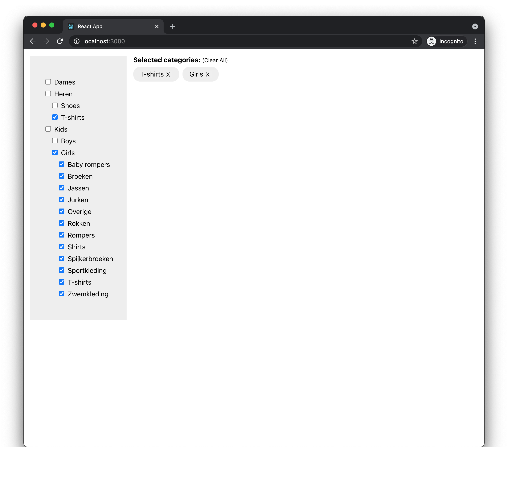

# Facets filter

This is a sample project to filter facets.

This project bootstrapped with [create-react-app](https://www.npmjs.com/package/create-react-app) tool

## Run the project

### Prerequisites

- Node.js (>=14)

### Steps

1. Install the dependencies  
   `npm i`
2. Start the development server  
   `npm run start`

This will start a local web server at http://localhost:3000 and open up your default browser.

### Tests

Following npm commands will run tests in watch mode.

`npm run test` - Run the test suits.  
`npm run test:coverage` - Run the coverage report.  

## Tech stack

- [React.js](http://reactjs.org/)